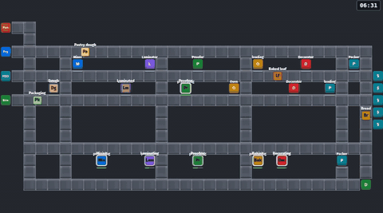
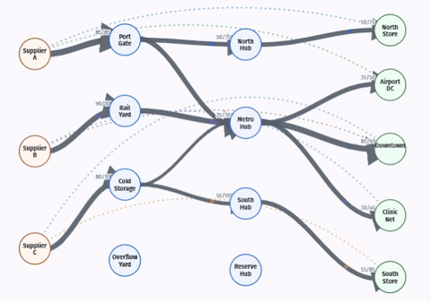
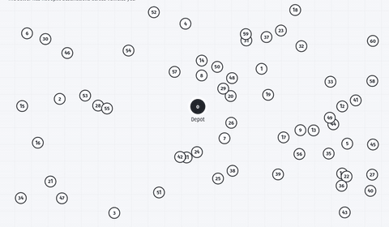
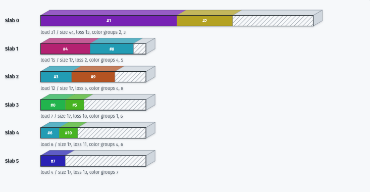

# Google OR-Tools for Web

Solve complex optimization models from TypeScript with Google OR-Tools running
as multithreaded WebAssembly.
Solve directly in the browser or on a native C++ server, using the same
TypeScript API.

[](https://github.com/Axelwickm/or-tools-wasm)
[](https://www.npmjs.com/package/or-tools-wasm)

[](https://github.com/Axelwickm/or-tools-wasm/actions/workflows/package.yml)
[](https://github.com/Axelwickm/or-tools-wasm/actions/workflows/server.yml)
[](https://github.com/Axelwickm/or-tools-wasm/actions/workflows/package.yml)
[](https://github.com/Axelwickm/or-tools-wasm/actions/workflows/package.yml)
[](https://github.com/Axelwickm/or-tools-wasm/actions/workflows/package.yml)
[](https://github.com/Axelwickm/or-tools-wasm/actions/workflows/package.yml)
[](https://github.com/Axelwickm/or-tools-wasm/actions/workflows/package.yml)
[](https://github.com/Axelwickm/or-tools-wasm/actions/workflows/package.yml)
[](https://github.com/Axelwickm/or-tools-wasm/actions/workflows/package.yml)
[](https://github.com/Axelwickm/or-tools-wasm/actions/workflows/package.yml)
[](https://github.com/Axelwickm/or-tools-wasm/actions/workflows/package.yml)
[](https://github.com/Axelwickm/or-tools-wasm/actions/workflows/package.yml)
[](https://github.com/Axelwickm/or-tools-wasm/actions/workflows/package.yml)
[](https://github.com/Axelwickm/or-tools-wasm/actions/workflows/package.yml)
[](https://github.com/Axelwickm/or-tools-wasm/actions/workflows/package.yml)
[](https://github.com/Axelwickm/or-tools-wasm/actions/workflows/package.yml)

[Try online in your browser](https://axelwickman.com/or-tools-wasm?utm_source=or-tools-wasm&utm_medium=readme&utm_campaign=try_online)

Used in [PragmaPlanner](https://pragmaplanner.com/?utm_source=or-tools-wasm&utm_medium=readme&utm_campaign=used_in)

<p>
  
  
</p>
<p>
  
  
  
</p>
<p>
  
</p>

## What is it?

**or-tools-wasm brings Google OR-Tools to TypeScript and JavaScript**, with support for running optimization models directly in the browser using multithreaded WebAssembly, in Node.js, Deno, or Bun, or on a native C++ server through the same API.

[Google OR-Tools](https://developers.google.com/optimization) is a collection of optimization solvers for problems such as **scheduling, vehicle routing, assignment, packing, resource allocation, constraint programming, and linear and integer programming**. Its CP-SAT and routing solvers can search enormous numbers of possible solutions to find feasible or optimal decisions under complex constraints.

or-tools-wasm provides TypeScript model builders, solver controls, and typed result APIs on top of these solvers. This makes it possible to build applications such as calendar and staff scheduling, delivery route optimization, production planning, job assignment, and other constraint-based optimization tools without maintaining a separate optimization backend.

## Usage

Install from npm:

```sh
npm install or-tools-wasm
```

Public APIs use solver-scoped imports. For example, build a CP-SAT model and
solve it:

```ts
import { CpModel, CpSat } from 'or-tools-wasm/cp-sat';

const model = new CpModel();

const desks = model.newIntVar(0, 4, 'desks');
const tables = model.newIntVar(0, 3, 'tables');

model.addLinearConstraint(desks.times(3).plus(tables.times(4)), 0, 12);
model.maximize(desks.times(20).plus(tables.times(30)));

const result = await CpSat.solve(model, { numWorkers: 1 });

console.log(result.status);
if (result.hasSolution) {
  console.log({
    desks: result.value(desks),
    tables: result.value(tables),
    profit: result.objectiveValue,
  });
}
```

Browser calls use a worker by default to keep the main thread responsive.
Choose `executor: 'direct'` or `'worker'` explicitly, or pass
`executor: { type: 'server', url: 'http://localhost:17827' }` for native execution.

Start the native server from the repository root:

```sh
docker compose -f server/docker-compose.yml up --build
```

Solve calls share execution controls: `executor` selects where to run,
`onEvent` reports progress, and `signal` requests cancellation.

### Managed cloud

**Build your app. Let us run the solvers.** Send optimization jobs through an API.
We handle the compute, queues, and scaling.
[Explore cloud / early access](https://or-tools-wasm-api.axelwickman.com/info).
Cloud execution currently checks service status and reports unavailability;
it does not upload or solve models.

After the first completed local solve, the library prints a cloud notice with
`console.info`, once per JavaScript context (page, process, or independent worker).
The notice makes no network request. To suppress it before solving:

```ts
import { setCloudNoticeEnabled } from 'or-tools-wasm';
setCloudNoticeEnabled(false);
```

The setting is also exported by every solver subpath. Command-line applications
can instead set `ORTOOLS_WASM_CLOUD_NOTICE=0`. Explicit cloud status messages are
unaffected.

To explore locally, see the [example site guide](docs/testing.md) and
[native server setup](server/README.md).

> [!WARNING]
> Local browser WASM requires cross-origin isolation headers for WebAssembly threads.
> See [Browser requirements](#browser-requirements) below.

## API reference

See [docs/api.md](docs/api.md) for the full TypeScript API reference.

## Benchmarking

See [benchmarking/](benchmarking/).

## Supported OR-Tools surface

| OR-Tools surface | or-tools-wasm | Description |
| --- | --- | --- |
| CP-SAT | ✅ | Constraint and integer optimization for Boolean, integer, scheduling, and logical models. |
| Routing | ✅ | Vehicle routing (VRP), TSP, pickup-delivery, capacity constraints, and route dimensions. |
| MPSolver API | ✅ | Linear and mixed-integer programming wrapper; this package includes GLOP LP, CLP LP, GLPK LP/MIP, SCIP MIP, CBC MIP, BOP MIP, Knapsack MIP, and SAT MIP backends. |
| MathOpt API | ✅ | Unified modeling and solve API with incremental solving and callback support; this package includes GLOP, GLPK, GSCIP, CP-SAT, and PDLP backends. |
| GLOP | ✅ | Google's simplex linear programming solver. |
| PDLP | ✅ | First-order LP and convex diagonal quadratic solver for very large models. |
| SAT integer programming | ✅ | CP-SAT-backed integer programming backend for pure integer linear models. |
| CLP | ✅ | COIN-OR linear programming backend. |
| GLPK | ✅ | GNU linear and mixed-integer programming backend. |
| SCIP / GSCIP | ✅ | SCIP-based mixed-integer backend through MPSolver and MathOpt. |
| CBC | ✅ | COIN-OR branch-and-cut mixed-integer programming backend through MPSolver. |
| BOP | ✅ | Boolean/integer optimization backend through MPSolver. |
| Knapsack | ✅ | Dedicated 0-1 and multi-dimensional knapsack solver, plus the MPSolver Knapsack backend. |
| Network flow algorithms | ✅ | Dedicated max-flow, min-cost-flow, and linear-sum assignment graph algorithms. |
| Assignment algorithms | ✅ | Linear-sum assignment through the dedicated Network Flow API. |
| Set cover | ✅ | Dedicated weighted set cover model, invariant, and heuristic search API. |
| RCPSP | ✅ | CP-SAT-backed resource-constrained project scheduling model, parser, and visual scheduling surface. |
| Linear Solver ModelBuilder |  | Ergonomic LP/MIP modeling API with import/export helpers and backend solve helpers. |

Unchecked rows are planned OR-Tools targets that are not exposed by this package
yet. Commercial and large third-party native backends such as Gurobi, CPLEX,
XPRESS, HiGHS, OSQP, ECOS, and SCS are not planned.

The TypeScript modeling APIs follow OR-Tools concepts, and the fixture suite
tracks upstream Python behavior where supported. One-shot `solve()` calls take
an options object and return an independent result. CP-SAT also preserves the
serialized-model path through `CpSat.solveProto()`. Specialized stateful APIs,
including `CpSolver`, the `pywraplp`-style MPSolver interface, and incremental
MathOpt, remain available; see the API reference for their contracts.

The worker script and WebAssembly files are emitted automatically from package
imports, with no manual copying into `public/` or `static/` required.

## Fixture test matrix

Shared solver tests run across Vite, Webpack, Rollup, Node, Deno, and Bun.
Browser coverage includes Chromium and Firefox. CI checks direct and worker
execution, plus native server execution in Node, Bun, Deno, and Vite Chromium.

The example site is tested too: every solver example runs a real solve, with
additional checks for main parameters, mobile layouts, server errors, and
optional authentication.

See the [testing guide](docs/testing.md) for commands, matrix details, and site
test coverage.

## Browser requirements

Local browser WASM builds use WebAssembly threads, so pages must be served with
cross-origin isolation enabled:

```http
Cross-Origin-Opener-Policy: same-origin
Cross-Origin-Embedder-Policy: require-corp
```

Without these headers, solving can fail during WebAssembly runtime or worker
startup.

Server-only execution does not load local WASM and does not require these
headers. The server must still be reachable from the page under the browser's
CORS and mixed-content rules.

See [Bundler configuration](#bundler-configuration) for Vite, Webpack, and
Rollup setup.

## Bundler configuration

See [docs/bundlers.md](docs/bundlers.md) for Vite, Webpack, and Rollup setup.

## Node, Deno, and Bun

Node and Bun work with normal ESM imports and do not need browser
cross-origin-isolation headers.

Deno needs permissions to read package assets and inspect CPU count:

```sh
deno run --allow-read --allow-sys=cpus your-script.ts
```

Server execution also needs `--allow-net` permission for the server endpoint.

Node uses the JSPI runtime when `WebAssembly.promising` is available and falls
back to Asyncify otherwise. Deno and Bun use the package's Asyncify runtime
path.

## Upstream OR-Tools

This repository vendors Google OR-Tools and adds a JavaScript/WebAssembly
packaging layer on top. OR-Tools is Google's open-source suite for solving
combinatorial optimization problems, including CP-SAT, linear programming,
routing, bin packing, and graph algorithms.

Upstream project:

- Source: [github.com/google/or-tools](https://github.com/google/or-tools)
- Documentation: [developers.google.com/optimization](https://developers.google.com/optimization/)
- License: Apache License 2.0

## Maintainer

Maintained by [Axel Wickman](https://axelwickman.com).

## License

This project is licensed under the Apache License 2.0. See [LICENSE](LICENSE).
