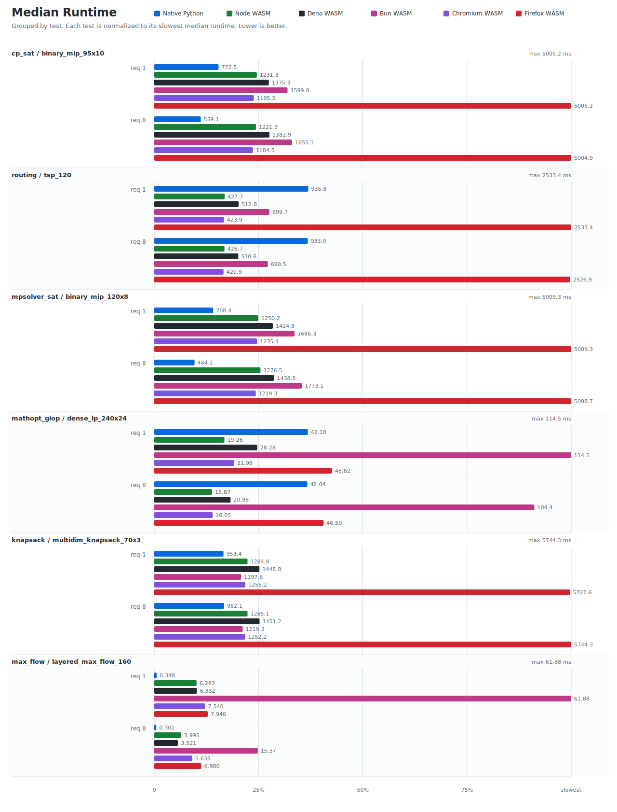

# OR-Tools Benchmarking

Run the benchmark suite:

```sh
benchmarking/run.sh
```

This packs the local npm package, runs the Docker benchmarks, writes CSVs under `benchmarking/results/`, and refreshes this report. To rerender existing CSVs only:

```sh
python3 benchmarking/scripts/render_results.py
```

<!-- benchmark-report:start -->
## Latest Results

Generated by `python3 benchmarking/scripts/render_results.py` from `benchmarking/results/*.csv`.
Values are medians across recorded runs after the unrecorded warmup solve.

Source CSVs: `native-python.csv`, `wasm-bun.csv`, `wasm-deno.csv`, `wasm-node.csv`, `web-chromium.csv`, `web-firefox.csv`. Git SHA: `11ea4e1c6d`. OR-Tools versions: Native Python `9.15.6755`; Node WASM `9.15`; Deno WASM `9.15`; Bun WASM `9.15`; Chromium WASM `9.15`; Firefox WASM `9.15`.



| Suite | Solver | Problem | Requested threads | Native Python ms | Node WASM ms | Deno WASM ms | Bun WASM ms | Chromium WASM ms | Firefox WASM ms |
| --- | --- | --- | ---: | ---: | ---: | ---: | ---: | ---: | ---: |
| core | cp_sat | binary_mip_95x10 | 1 | 772.5 | 1231.3 | 1375.3 | 1599.8 | 1195.5 | 5005.2 |
| core | cp_sat | binary_mip_95x10 | 8 | 559.1 | 1221.3 | 1382.9 | 1655.1 | 1184.5 | 5004.9 |
| core | routing | tsp_120 | 1 | 935.8 | 427.7 | 512.8 | 699.7 | 423.9 | 2533.4 |
| core | routing | tsp_120 | 8 | 933.0 | 426.7 | 510.6 | 690.5 | 420.9 | 2526.9 |
| core | mpsolver_sat | binary_mip_120x8 | 1 | 708.4 | 1250.2 | 1424.8 | 1686.3 | 1235.4 | 5009.3 |
| core | mpsolver_sat | binary_mip_120x8 | 8 | 484.2 | 1276.5 | 1438.5 | 1773.1 | 1219.3 | 5008.7 |
| core | mathopt_glop | dense_lp_240x24 | 1 | 42.18 | 19.26 | 28.28 | 114.5 | 21.98 | 48.82 |
| core | mathopt_glop | dense_lp_240x24 | 8 | 42.04 | 15.87 | 20.95 | 104.4 | 16.05 | 46.50 |
| core | knapsack | multidim_knapsack_70x3 | 1 | 953.4 | 1284.8 | 1448.8 | 1197.6 | 1255.2 | 5727.6 |
| core | knapsack | multidim_knapsack_70x3 | 8 | 962.1 | 1285.1 | 1451.2 | 1219.2 | 1252.2 | 5744.3 |
| core | max_flow | layered_max_flow_160 | 1 | 0.348 | 6.283 | 6.332 | 61.88 | 7.540 | 7.940 |
| core | max_flow | layered_max_flow_160 | 8 | 0.301 | 3.995 | 3.521 | 15.37 | 5.635 | 6.980 |
<!-- benchmark-report:end -->

Suite definitions live in `suites.json`.
