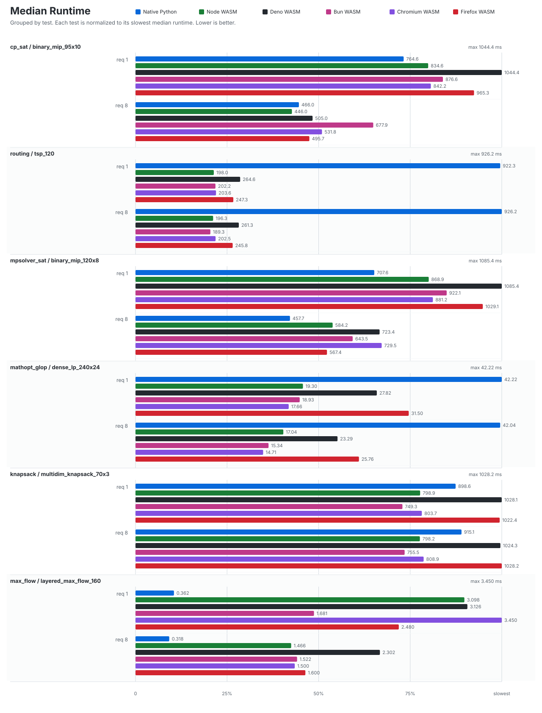

# OR-Tools Benchmarking

The generated results below describe the recorded commit and runtime versions,
not necessarily the current worktree. They are performance measurements, not
a substitute for the fixture and site test suites.

Run the benchmark suite:

```sh
benchmarking/run.sh
```

This packs the local npm package, runs the Docker benchmarks, writes CSVs under `benchmarking/results/`, and refreshes this report. To rerender existing CSVs only:

```sh
python3 benchmarking/scripts/render_results.py
```

<!-- benchmark-report:start -->
## Latest Results

Generated by `python3 benchmarking/scripts/render_results.py` from `benchmarking/results/*.csv`.
Values are medians across recorded runs after the unrecorded warmup solve.

Source CSVs: `native-python.csv`, `wasm-bun.csv`, `wasm-deno.csv`, `wasm-node.csv`, `web-chromium.csv`, `web-firefox.csv`. Git SHA: `56151a9709-dirty`. OR-Tools versions: Native Python `9.15.6755`; Node WASM `9.15`; Deno WASM `9.15`; Bun WASM `9.15`; Chromium WASM `9.15`; Firefox WASM `9.15`.



| Suite | Solver | Problem | Requested threads | Native Python ms | Node WASM ms | Deno WASM ms | Bun WASM ms | Chromium WASM ms | Firefox WASM ms |
| --- | --- | --- | ---: | ---: | ---: | ---: | ---: | ---: | ---: |
| core | cp_sat | binary_mip_95x10 | 1 | 764.6 | 834.6 | 1044.4 | 876.6 | 842.2 | 965.3 |
| core | cp_sat | binary_mip_95x10 | 8 | 466.0 | 446.0 | 505.0 | 677.9 | 531.8 | 495.7 |
| core | routing | tsp_120 | 1 | 922.3 | 198.0 | 264.6 | 202.2 | 203.6 | 247.3 |
| core | routing | tsp_120 | 8 | 926.2 | 196.3 | 261.3 | 189.3 | 202.5 | 245.8 |
| core | mpsolver_sat | binary_mip_120x8 | 1 | 707.6 | 868.9 | 1085.4 | 922.1 | 881.2 | 1029.1 |
| core | mpsolver_sat | binary_mip_120x8 | 8 | 457.7 | 584.2 | 723.4 | 643.5 | 729.5 | 567.4 |
| core | mathopt_glop | dense_lp_240x24 | 1 | 42.22 | 19.30 | 27.82 | 18.93 | 17.66 | 31.50 |
| core | mathopt_glop | dense_lp_240x24 | 8 | 42.04 | 17.04 | 23.29 | 15.34 | 14.71 | 25.76 |
| core | knapsack | multidim_knapsack_70x3 | 1 | 898.6 | 798.9 | 1028.1 | 749.3 | 803.7 | 1022.4 |
| core | knapsack | multidim_knapsack_70x3 | 8 | 915.1 | 798.2 | 1024.3 | 755.5 | 808.9 | 1028.2 |
| core | max_flow | layered_max_flow_160 | 1 | 0.362 | 3.098 | 3.126 | 1.681 | 3.450 | 2.480 |
| core | max_flow | layered_max_flow_160 | 8 | 0.318 | 1.466 | 2.302 | 1.522 | 1.500 | 1.600 |
<!-- benchmark-report:end -->

Suite definitions live in `suites.json`.
